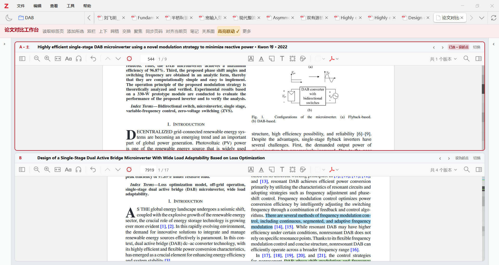
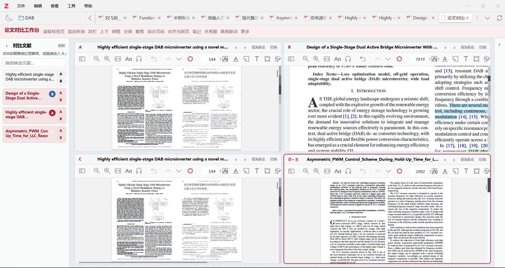
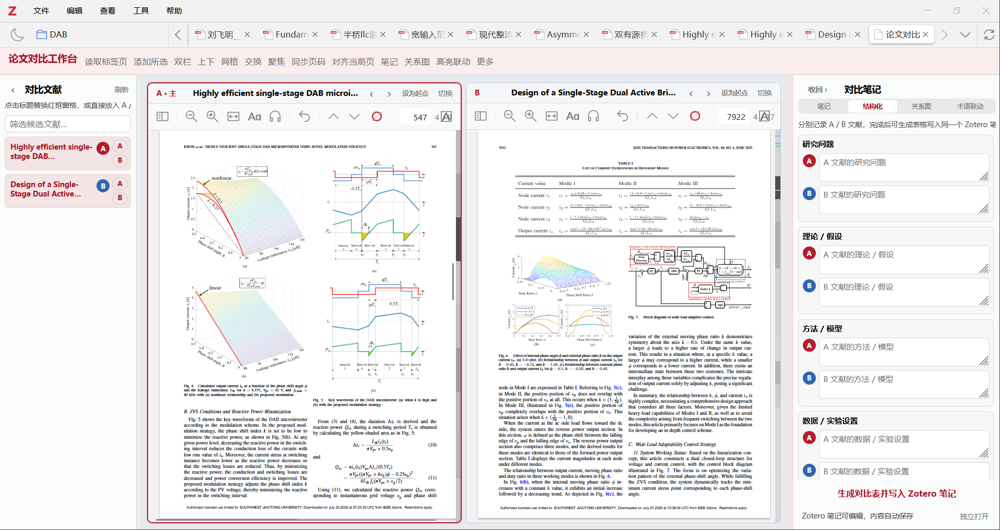
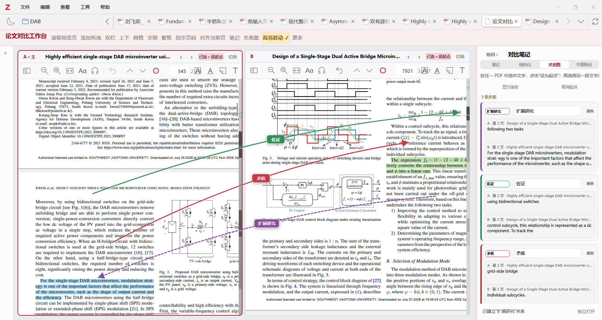
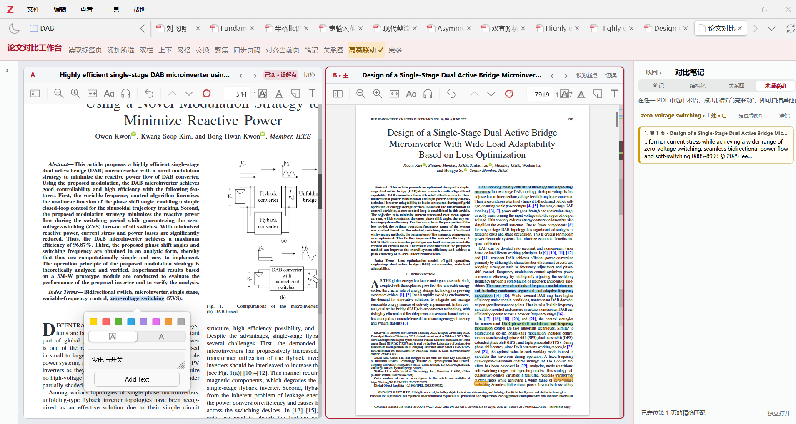

# Zotero 论文分屏


一个直接嵌入 Zotero 主窗口的多文献对比阅读工作台。它复用 Zotero 原生 PDF Reader，在同一个标签页中并排阅读、标注和切换论文，并进一步提供结构化笔记、跨文献关系连线和术语高亮联动。

> 当前版本：`0.7.2` · 支持 Zotero `7.0–9.0.x` · PDF 内容分析在本地完成

## 为什么使用这个插件

普通的多标签阅读适合逐篇查看，但在比较方法、实验设置和结论时，经常需要来回切换并手工记录对应关系。Zotero 论文分屏把这些步骤集中到一个工作台中：

- 同时阅读 2–4 篇 PDF，并保留 Zotero 原生搜索、批注和阅读器侧栏。
- 在 A/B 论文之间快速切换、交换、上下排列、网格排列或聚焦单篇精读。
- 直接搜索当前 Zotero 文献库，将带 PDF 的条目加入候选区。
- 用结构化字段并排记录研究问题、方法、数据、结果和局限。
- 将两段原文连接为“佐证”“矛盾”“方法改进”等可视化关系。
- 选中术语后扫描其他已显示论文，定位所有精确匹配位置。
- 自动适配不同窗口宽度、笔记本屏幕和高 DPI 缩放。

## 功能概览

| 功能 | 说明 |
| --- | --- |
| 多窗格阅读 | 双栏、上下双窗格、四窗格网格和单篇聚焦模式 |
| 原生 Reader | 保留 PDF 文字层、搜索、缩放、翻页、批注、侧栏和 Reader 插件事件 |
| 文献管理 | 搜索 Zotero 文献库、加入 A/B、切换窗格、候选移除和自动补位 |
| 对比笔记 | Zotero 原生富文本笔记与 A/B 结构化对比表 |
| 关系拓扑 | 跨论文原文连线、关系标签、卡片管理和双向跳转 |
| 术语联动 | 本地全文扫描、精确高亮、结果列表和上一处/下一处导航 |
| 阅读同步 | 同步页码、设置相对页码起点、全部窗格同时翻页 |
| 响应式布局 | 侧栏折叠、笔记栏拖动、窄屏抽屉和 PDF 页宽自动重排 |

## 安装

### 从 GitHub Releases 安装

1. 打开项目的 [Releases](https://github.com/sukui10/zotero-split-screen/releases) 页面。
2. 下载最新的 `zotero-split-screen-*.xpi`。
3. 在 Zotero 中打开“工具 → 附加组件”。
4. 点击右上角齿轮，选择“Install Add-on From File…”（从文件安装插件）。
5. 选择下载的 `.xpi`；如 Zotero 提示，请重启应用。

### 从源码构建

在 Windows PowerShell 中进入项目目录并执行：

```powershell
powershell -ExecutionPolicy Bypass -File .\scripts\build.ps1
```

构建脚本会运行 JavaScript 语法检查和核心测试，然后在 `dist` 目录生成对应版本的 XPI。

## 快速上手

1. 在 Zotero 主文献列表中选择至少两篇带 PDF 附件的文献。
2. 右键选择“在论文对比工作台中打开”，或使用“工具 → 论文对比 → 打开或添加所选文献”。
3. 在工作台中点击窗格，使其成为红框高亮的活动窗格。
4. 点击左侧候选文献标题替换活动窗格，或点击 `A` / `B` 放入指定位置。
5. 使用顶部工具栏切换布局、交换论文、聚焦阅读、同步页码或打开对比笔记。

工作台内部新增文献统一通过左侧搜索框完成。输入至少两个字符后，插件会搜索当前 Zotero 文献库的标题、作者和年份，并只显示带 PDF 的结果。点击“添加”只会加入当前候选列表，不会复制或移动 Zotero 文献。

候选卡片上的“×”只会将文献移出当前对比列表，不会删除 Zotero 条目、PDF、批注或笔记。若被移除的文献正在显示，其他候选会自动补位；只剩一篇时自动切换为全宽单窗格。

## 阅读布局

### 上下对比

适合比较较宽的公式、表格或电路图。两个 Reader 可以独立滚动、缩放和标注。



### 四窗格网格

网格模式最多同时显示四篇论文，适合快速核对多种方法或实验结果。默认仍以 A/B 双栏启动，只有主动点击“网格”后才显示更多窗格。



### 聚焦与响应式布局

点击任意窗格后再启用“聚焦”，当前论文会占满整个阅读区；退出聚焦后恢复原布局。左侧文献栏和右侧笔记栏均可折叠，笔记栏可以从左边缘拖动调整宽度。

宽屏下，笔记栏停靠在右侧，A/B 严格均分剩余空间；特别窄的窗口使用覆盖式笔记抽屉，收回后完全释放论文 B 的显示区域。窗口、侧栏或显示器 DPI 变化后，内嵌 Reader 会重新计算页宽。

## 结构化对比笔记

右侧“笔记”标签使用 Zotero 原生富文本编辑器；“结构化”标签则提供成对的 A/B 字段，包括：

- 研究问题
- 理论 / 假设
- 方法 / 模型
- 数据 / 实验设置
- 评价指标
- 关键结果
- 创新点
- 局限与适用范围
- 可复现性
- 我的判断

结构化内容会自动保存，也可以生成对比表并写入同一篇 Zotero 笔记。PDF 批注或文字可拖入字段，并附带窗格和页码信息。



## 跨文献关系图

关系图把“这两段文字有什么关系”直接显示在论文之间，而不只记录成孤立文字。

1. 在 A 文中选中一句原文，点击窗格标题栏的“设为起点”。
2. 在 B 文中选中另一段原文，点击“连接”。
3. 在右侧关系卡片中选择“佐证”“矛盾”“方法相似”“方法改进”“样本差异”等类型。
4. 编辑关系说明，或点击卡片端点跳回对应论文页面。



关系锚点保存页码、原文上下文和页面归一化坐标。滚动、缩放或翻页时，连线会持续重新定位：

- 两端可见时，绘制精确完整连线。
- 一端离屏时，连线停靠到对应窗格边缘。
- 两端均离屏时，以同色短线表示相对方向。
- 原文重新进入视野后，自动恢复精确连线。

连线只是工作台叠加层，不会写入 PDF，也不会覆盖或删除 Zotero 原生批注。

## 精确术语联动

在任一 PDF 中选中不超过 120 个字符的术语或短语，然后点击“高亮联动”。插件会读取其他当前已显示 PDF 的文字层，在本地查找精确匹配，并打开右侧结果列表。



术语联动支持：

- 忽略英文大小写、软连字符和换行断词。
- 显示匹配文献、页码和上下文摘要。
- 点击结果后跳转、重试文字级高亮并闪烁定位。
- 使用“上一处/下一处术语匹配”连续浏览。
- 页面文字层暂不可用时显示目标页边框提示。
- Reader 逐页读取失败时，尝试使用 Zotero PDFWorker 提取全文。

当前只扫描已经显示在双栏或网格中的其他论文，不会在后台自动载入全部候选文献。扫描件或没有可读取文字层的 PDF 无法执行精确术语匹配。

## 工具栏说明

| 按钮 | 功能 |
| --- | --- |
| 双栏 / 上下 / 网格 | 切换阅读布局 |
| 交换 | 交换前两个窗格中的论文 |
| 聚焦 | 当前活动论文占满阅读区，再次点击恢复 |
| 同步页码 | 以红框活动窗格为主窗格，同步其他论文页码 |
| 对齐当前页 | 将各窗格当前页设为相对同步起点 |
| 笔记 | 打开或收回 Zotero 对比笔记 |
| 关系图 | 展开关系卡片和跨文献连线 |
| 高亮联动 | 扫描其他已显示 PDF 中的选中术语 |
| 更多 | 全部窗格翻页、术语结果导航和最大化论文区域 |

> 截图来自功能迭代过程。`0.7.2` 已精简工作台内的“读取标签页”“添加所选”和“刷新已打开 PDF”入口；新增候选文献请使用左侧文献库搜索。

## 数据、保存与隐私

- PDF 全文读取、术语匹配和高亮定位均在本地 Zotero 环境中完成。
- 插件不会上传 PDF、选区、笔记或关系数据。
- 原生对比笔记保存为 Zotero 笔记；结构化字段和关系数据保存在 Zotero 插件首选项中。
- 工作台会保存布局、侧栏状态、窗格文献和最近阅读页。
- 移除候选文献只影响当前对比工作台，不会删除 Zotero 数据。

## 同步行为

当前同步的是 PDF 页码，而不是像素级滚动位置。页码同步不依赖 PDF.js 的滚动 DOM，跨 Zotero 版本更稳定，也更适合章节结构相近的论文。

如果两篇论文的封面、目录或附录页数差异较大，可以先分别定位到方法或实验章节，点击“对齐当前页”，再开启同步。

## 兼容性与限制

- 清单声明支持 Zotero `7.0–9.0.x`。
- 当前只处理 PDF，不处理 EPUB、网页快照或补充材料压缩包。
- 每篇普通文献默认选取第一个 PDF 附件。
- 候选文献最多 12 篇；网格最多同时显示 4 个窗格。
- 术语联动目前是精确匹配，不是语义相似度或近义概念识别。
- 跨文献关系采用稳定的“设为起点 → 连接”流程，尚未实现直接拖拽原文画线。
- 当前同步页码，不同步像素级滚动位置，也不自动进行章节语义对齐。
- 内嵌窗格复用了 Zotero 内部 Reader 接口；Zotero 主版本调整该接口后，插件可能需要同步适配。
- 部分只识别标准 `ReaderTab` 的第三方插件可能无法识别对比窗格。
- 当前开发清单使用保留的空更新地址，不会自动下载新版本，请通过 Releases 手动更新。

## 项目结构

```text
zotero-split-screen/
├─ bootstrap.js          # Zotero 插件生命周期入口
├─ split-screen.js       # 工作台、Reader、关系图和术语联动逻辑
├─ workspace.css         # 工作台界面与响应式布局
├─ manifest.json         # 插件清单与 Zotero 兼容范围
├─ icon.svg              # 插件图标
├─ pictures/             # README 功能截图
├─ scripts/build.ps1     # 检查并构建 XPI
├─ tests/core.test.js    # 无依赖核心测试
└─ docs/TESTING.md       # 手动验收清单
```

## 开发与测试

语法检查和核心测试：

```powershell
node --check bootstrap.js
node --check split-screen.js
node tests/core.test.js
```

完整构建：

```powershell
powershell -ExecutionPolicy Bypass -File .\scripts\build.ps1
```

手动回归项目见 [`docs/TESTING.md`](docs/TESTING.md)。遇到运行问题时，可在 Zotero 中打开“帮助 → 调试输出日志”，搜索以 `Zotero Split Screen:` 开头的记录。

## 反馈

如果遇到 PDF 无法加载、界面尺寸异常、关系锚点偏移或术语扫描失败，请在 [Issues](https://github.com/sukui10/zotero-split-screen/issues) 中提供：

- Zotero 版本和操作系统版本
- 插件版本
- 问题截图
- 可复现步骤
- Zotero 调试输出中的相关错误
